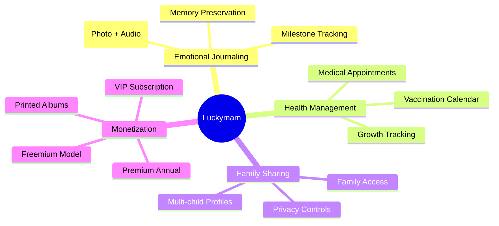
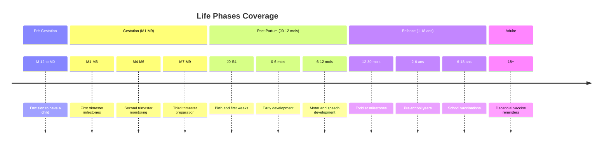
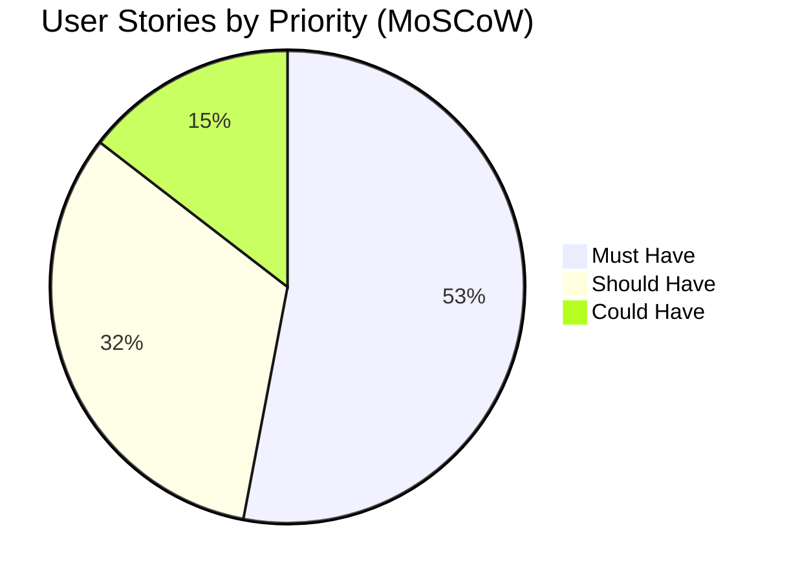
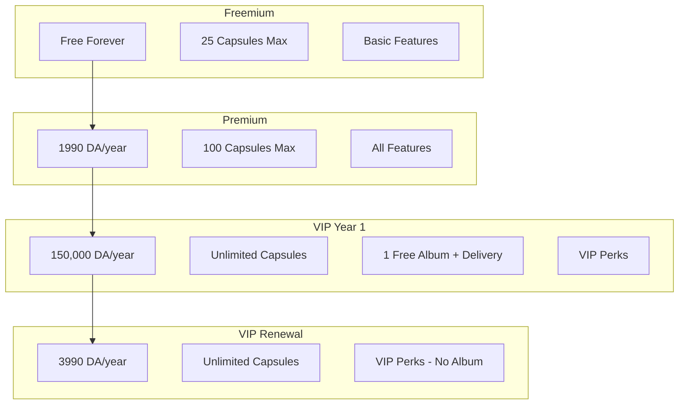
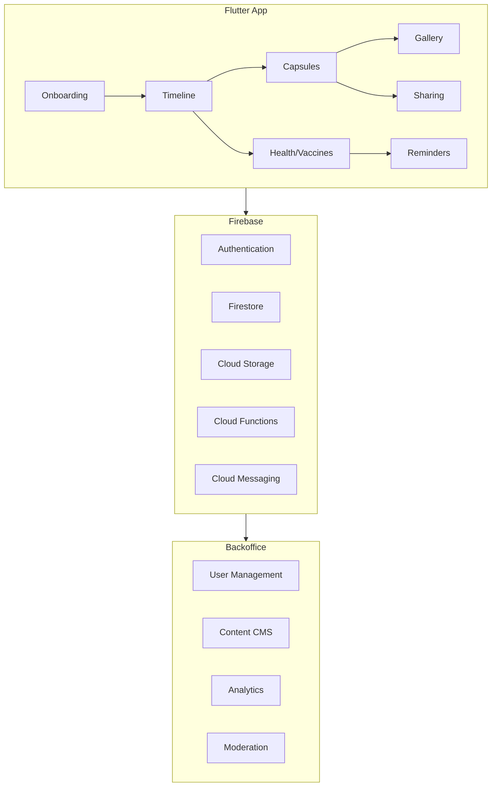
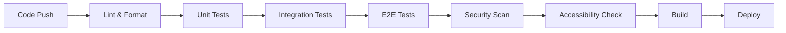
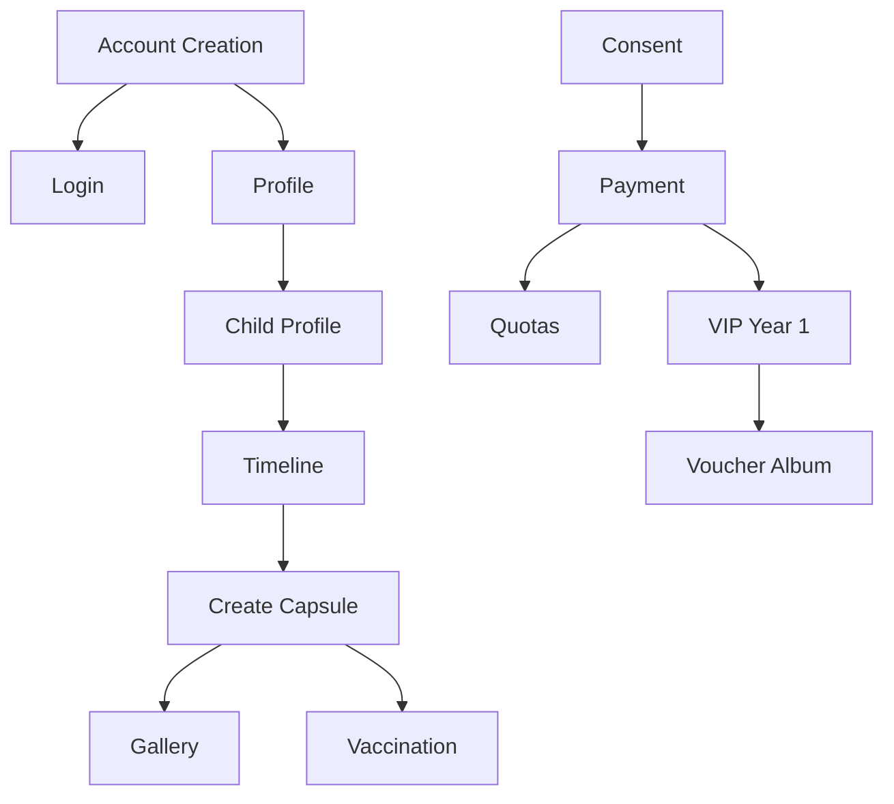

# Luckymam - Application Documentation

> **Version**: 1.0  
> **Date**: February 2026  
> **Type**: Mobile Application (Flutter)

---

## 📋 Executive Summary

**Luckymam** is a premium mobile application designed for mothers in **Algeria**, providing a complete lifecycle companion from **pre-pregnancy to childhood**. The app enables mothers to:

- 📸 **Capture emotional moments** as "Capsules" (photo + audio memories)
- 📅 **Track milestones** through an intelligent timeline
- 💉 **Manage vaccination schedules** based on the Algerian national calendar
- 👨‍👩‍👧 **Share memories** with family members
- 📖 **Create printed photo albums**

The application targets both **French** and **Arabic (RTL)** speaking users with a focus on cultural traditions and religious events.

---

## 🎯 Product Vision



---

## 📊 Data Architecture

### 1. Vaccination Database

The vaccination schedule follows the **Algerian National Vaccination Calendar** with comprehensive coverage from birth to adulthood.

| Age Range | Vaccine | Details |
|-----------|---------|---------|
| **Naissance** | BCG-HBV | Tuberculosis + Hepatitis B protection |
| **2 mois** | DTCaVPI-Hib-HBV + VPOb + VPC | Diphtheria, Tetanus, Pertussis, Polio, Haemophilus, Hepatitis B, Pneumococcal |
| **4 mois** | DTCaVPI-Hib-HBV + VPOb + VPC | Booster dose |
| **11 mois** | ROR | Measles, Mumps, Rubella |
| **12 mois** | DTCaVPI-Hib-HBV + VPOb + VPC | Final infant dose |
| **18 mois** | ROR | Booster dose |
| **6 ans** | DTCa-VPI | School-age booster |
| **11-13 ans** | dT | Adolescent booster |
| **16-18 ans** | dT | Teen booster |
| **Every 10 years (18+)** | dT | Adult decennial booster |

#### Vaccine Coverage Details

| Abbreviation | Full Name | Protection Against |
|--------------|-----------|-------------------|
| **BCG** | Bacille Calmette et Guérin | Tuberculosis complications |
| **HBV** | Hepatitis B Vaccine | Hepatitis B virus |
| **DTCaVPI-Hib** | Hexavalent | Diphtheria, Tetanus, Pertussis, Polio, Haemophilus |
| **VPOb** | Oral Polio Vaccine type b | Poliomyelitis |
| **VPC** | Pneumococcal Conjugate | Pneumococcal infections |
| **ROR** | Rougeole-Oreillons-Rubéole | Measles, Mumps, Rubella |
| **dT** | Reduced diphtheria toxoid | Tetanus, Diphtheria |

---

### 2. Life Events Timeline Database

The timeline covers **70 unique events** across **5 life phases**:



#### Event Categories

| Category | Count | Description |
|----------|-------|-------------|
| **Émotion** | 22 | Emotional moments to capture |
| **Santé** | 34 | Health milestones and medical visits |
| **Culture** | 8 | Cultural celebrations and traditions |
| **Religion** | 5 | Religious events (Aïd, Akika, Circoncision, Quran) |

#### Key Events by Phase

##### Gestation Phase (30 events)
- Monthly belly photos (M1-M9)
- 7 medical visits with ultrasounds
- Food cravings documentation ("WHAM")
- Baby gender reveal
- First fetal movements
- Nursery preparation

##### Post Partum Phase (26 events)
- First cry and breastfeeding
- Vaccination milestones (2, 4, 11, 12 months)
- Religious ceremonies (Circoncision, Akika)
- Developmental milestones (sitting, crawling, walking, first words)
- Dental development tracking

##### Childhood Phase (14 events)
- First day of preschool/school
- Religious milestones (Sourate Fatiha memorization)
- School-age vaccinations (6, 11-13, 16-18 years)

---

### 3. Product Backlog (User Stories)

The backlog contains **117 user stories** organized into **17 Epics** across a **12-month roadmap**.



---

## 🏗️ Feature Architecture

### Epic Overview

| Epic ID | Epic Name | Stories | Priority Focus |
|---------|-----------|---------|----------------|
| **1** | Onboarding & Compte | 10 | Account management, authentication |
| **2** | Onboarding & Profil | 1 | Profile setup |
| **3** | Famille | 6 | Child profiles, family sharing |
| **4** | Timeline | 6 | Milestone tracking, custom events |
| **5** | Capsules | 11 | Photo/audio memory capture |
| **6** | Reels | 3 | Educational video content |
| **7** | Admin Reels | 3 | Content management |
| **8** | Santé | 4 | Vaccination calendar, reminders |
| **9** | Monétisation | 12 | Subscriptions, payments |
| **10** | Admin Plateforme | 15 | Backoffice operations |
| **11** | Qualité & Compliance | 20 | GDPR, security, accessibility |
| **12** | Engagement | 5 | Notifications, lifecycle messaging |
| **13** | Paramètres | 5 | App settings, storage |
| **14** | Découverte | 4 | Search, recommendations |
| **15** | Privacy | 3 | Privacy controls |
| **16** | Security | 2 | Device security |
| **17** | Album papier | 4 | Printed album ordering |

---

## 🚀 Roadmap Phases

### Phase 1: MVP (M1-M3)

**Focus**: Core functionality launch

| Feature | Story Points |
|---------|--------------|
| Account creation & login | 18 |
| Consent management | 8 |
| Mother profile | 8 |
| Child profiles | 13 |
| Timeline view | 13 |
| Capsule creation | 21 |
| Gallery & filters | 16 |
| Plan display | 5 |
| Accessibility (WCAG AA) | 5 |
| RTL support (Arabic) | 5 |
| Performance optimization | 5 |

**Total: ~117 story points**

---

### Phase 2: Growth (M4-M6)

**Focus**: Health features, monetization, offline support

| Feature | Story Points |
|---------|--------------|
| Account deletion & export | 21 |
| 2FA authentication | 8 |
| SSO (Apple/Google) | 8 |
| Timeline offline mode | 8 |
| Admin milestone rules | 21 |
| Capsule editing & trash | 16 |
| Vaccination calendar | 8 |
| Vaccine reminders | 8 |
| Payment checkout (CIB/Edahabia) | 18 |
| Storage quotas | 8 |

**Total: ~124 story points**

---

### Phase 3: Engagement (M7-M9)

**Focus**: Social features, advanced content

| Feature | Story Points |
|---------|--------------|
| Custom milestones | 8 |
| Privacy levels per child | 8 |
| Family invitations | 13 |
| Social sharing with blur | 8 |
| Reels content | 13 |
| Admin reels workflow | 26 |
| Premium renewal | 8 |
| VIP subscription | 16 |
| Lifecycle campaigns | 8 |
| Remote config | 8 |
| Feature flags | 8 |

**Total: ~124 story points**

---

### Phase 4: Premium (M10-M12)

**Focus**: VIP features, printed albums

| Feature | Story Points |
|---------|--------------|
| Guest mode | 8 |
| Vault (biometric lock) | 13 |
| Reels scheduling | 5 |
| Offline reels caching | 8 |
| Auto-album suggestions | 8 |
| Home widget | 13 |
| Jailbreak detection | 13 |
| Screenshot protection | 8 |
| Printed album ordering | 34 |
| VIP voucher system | 13 |
| VIP perks management | 8 |

**Total: ~131 story points**

---

## 💰 Monetization Model

### Subscription Plans



### Payment Methods (Algeria-specific)

| Method | Type |
|--------|------|
| **CIB** | Algerian bank cards |
| **Edahabia** | Postal cards |
| **CCP** | Postal account |
| **Promo Codes** | Discount codes |

### Quota System

| Plan | Capsule Limit | Storage |
|------|---------------|---------|
| Freemium | 25 | Limited |
| Premium | 100 | Extended |
| VIP | Unlimited* | Unlimited* |

*Fair-use policy applies

---

## 🔐 Security & Compliance

### Data Protection

| Requirement | Implementation |
|-------------|----------------|
| **Password Hashing** | Secure hash + salt |
| **JWT Tokens** | Access + refresh tokens |
| **2FA** | SMS/OTP verification |
| **Encryption at Rest** | All personal data |
| **Local Encryption** | Device media storage |
| **Upload Security** | Antivirus scanning |
| **Rate Limiting** | API abuse protection |

### GDPR Compliance

| Feature | Story ID |
|---------|----------|
| **Consent Management** | LM2-004 |
| **Data Export** | LM2-007 |
| **Account Deletion** | LM2-006 |
| **Privacy Center** | LM2-064 |
| **DSAR Processing** | LM2-051 |
| **Data Retention** | LM2-077 |
| **Audit Logs** | LM2-050 |

### Accessibility (WCAG AA)

- High contrast ratios
- Focus management
- Screen reader support
- Dynamic text sizing
- RTL layout support

---

## 🌍 Internationalization

### Supported Languages

| Language | Direction | Priority |
|----------|-----------|----------|
| **French (FR)** | LTR | Primary |
| **Arabic (AR)** | RTL | Primary |
| **English (EN)** | LTR | Secondary |

### Cultural Considerations

| Category | Events |
|----------|--------|
| **Islamic Calendar** | Aïd el-Fitr, Aïd al-Adha |
| **Traditions** | Akika (feast), Circoncision |
| **Religious Education** | First Quran memorization |

---

## 📱 Technical Architecture

### Core Features



### Capsule Structure

```
Capsule {
    id: string
    userId: string
    childId: string
    milestoneId?: string
    photo: MediaRef
    audio: MediaRef (max 25 seconds)
    emotion: EmotionTag
    tags: string[]
    location?: GeoPoint (opt-in)
    createdAt: timestamp
    updatedAt: timestamp
    version: number
    isDeleted: boolean
}
```

### Timeline Rules Engine

```
MilestoneRule {
    id: string
    phase: Phase (pre-gestation|gestation|post-partum|childhood|adult)
    triggerAge: AgeCondition
    category: string (emotion|health|culture|religion)
    title: LocalizedString
    description: LocalizedString
    actions: Action[]
    version: number
    country: string (DZ default)
}
```

---

## 📈 Analytics Events

### Key Tracking Events

| Category | Events |
|----------|--------|
| **Onboarding** | `signup_started`, `signup_completed`, `login_success`, `profile_completed` |
| **Core Usage** | `timeline_opened`, `milestone_opened`, `capsule_created`, `gallery_opened` |
| **Health** | `vax_calendar_open`, `vax_reminder_set`, `vax_marked_done` |
| **Monetization** | `plan_viewed`, `payment_success`, `promo_applied`, `quota_blocked` |
| **Engagement** | `notif_snoozed`, `deeplink_open`, `share_link_created` |

---

## 🧪 Quality Assurance

### Test Coverage Requirements

| Type | Focus |
|------|-------|
| **E2E Tests** | Critical user journeys |
| **Unit Tests** | Business logic |
| **Integration Tests** | API contracts |
| **Accessibility Tests** | WCAG AA compliance |
| **Security Tests** | Vulnerability scanning |

### CI/CD Pipeline



---

## 👥 User Roles

### Application Roles

| Role | Permissions |
|------|-------------|
| **Mother (User)** | Full CRUD on own data, sharing, purchasing |
| **Family Member** | Read-only access to shared content |
| **Guest** | Local capsules only, no sync |

### Admin Roles

| Role | Permissions |
|------|-------------|
| **Admin** | Full platform access |
| **Content Reviewer** | Reels approval/rejection |
| **DPO** | DSAR, retention policies |
| **Support** | Ticket management |
| **Security Admin** | Secrets, KMS rotation |

---

## 📦 Deliverables Summary

| Deliverable | Description |
|-------------|-------------|
| **Flutter Mobile App** | iOS & Android |
| **Firebase Backend** | Auth, Firestore, Storage, Functions |
| **Admin Backoffice** | Web-based management console |
| **API Documentation** | OpenAPI specs |
| **Privacy Policy** | In-app versioned policy |
| **User Guide** | Interactive onboarding |

---

## 🔗 Key Dependencies

### Story Dependencies Graph



---

## 📝 Glossary

| Term | Definition |
|------|------------|
| **Capsule** | A memory unit containing photo + audio + metadata |
| **Milestone** | A predefined or custom life event |
| **Timeline** | Visual representation of milestones over time |
| **Jalon** | French for milestone |
| **VPC** | Vaccin Pneumocoque Conjugué |
| **DSAR** | Data Subject Access Request |
| **Entitlement** | A feature or benefit tied to a subscription plan |
| **Akika** | Traditional celebration for newborn in Islamic culture |

---

> **Note**: This documentation is based on the product backlog version **29-01-2026**. Features and priorities may evolve.

---

*Generated from data analysis: `Base des données Vaccin.csv`, `DATA BASE LINE DE VIE.csv`, `Luckymam_Backlog_V29-01-2026.csv`*
